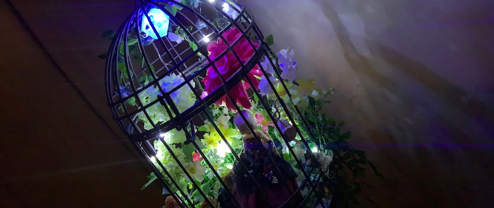
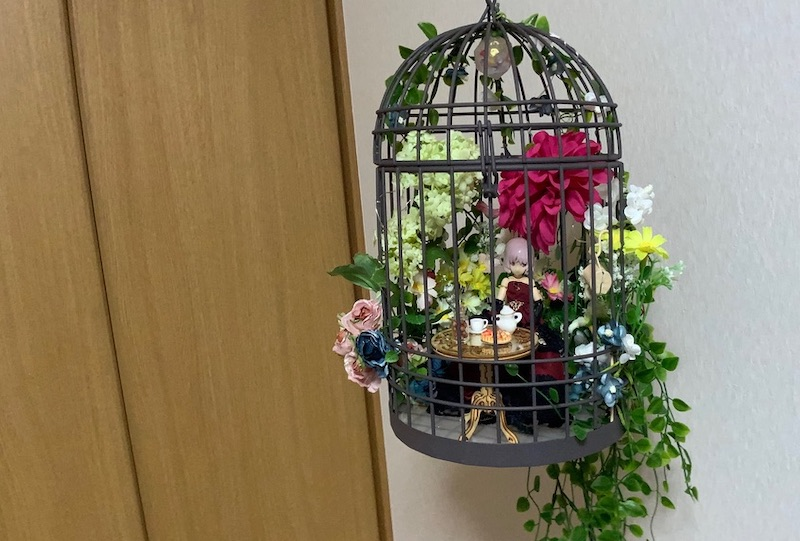

# Cage Garden

このプロジェクトは、鳥かごで作られた庭園風のディスプレイと、そのディスプレイの光と音の演出をM5ATOM Liteで行うものです。

- 3系統のLEDイルミネーション(ダイソー製)をそれぞれ独立して1/fゆらぎ制御しています。
- 天井のRGB LEDは OpenWeatherMap の APIから取得した天気情報に応じて色を変化させています。
- 環境音は　DFPlayer mini を使用して再生しており、RGB LEDと同様に天気に応じて変化させています。
- これらの制御を一つのM5ATOM Lite で行っています。

## Reference Material and Articles

- [YouTube](https://youtu.be/ygR6PYfMCBo)
- [製作記: M5Atom を使って光と音の演出付きの1/12フィギュア/ガールプラモ用の箱庭作った](https://uzukiaoba.hatenablog.com/entry/2020/09/24/001600)

## Contents

- [cage-garde-control-m5atom](cage-garde-control-m5atom): M5ATOM 用のArduinoスケッチです。
    - 次のArduinoライブラリに依存しています。
        - ArduinoJson 6
        - DFRobotDFPlayerMini
    - [config.h.template](cage-garde-control-m5atom/config.h.template) をコピーして `config.h` にリネームし、WiFiの設定とOpenWheatherMapのAPI Keyを設定してください。
- [doc](doc): ドキュメント関連のファイルです。
